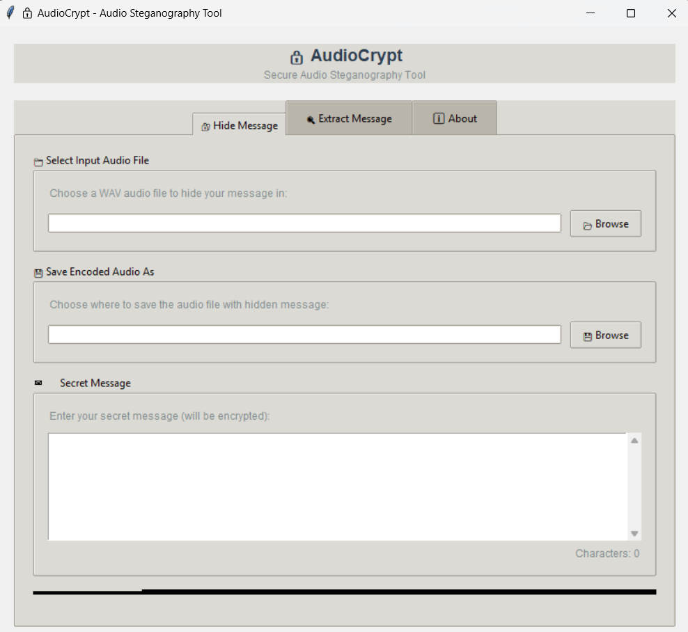

# 🔒 AudioCrypt

**AudioCrypt** is a secure steganography tool that hides encrypted messages inside WAV audio files using AES-256 encryption and LSB (Least Significant Bit) techniques. Built with a user-friendly dark-themed GUI and optional CLI, it's designed for secure communication and data hiding in audio media.

---

## 🎯 Features

- 🔐 AES-256 encryption (CBC mode)
- 🎧 LSB-based audio steganography
<!-- - 🖥️ Dark-themed GUI built with Tkinter -->
- 🎛️ Optional Command Line Interface (CLI)
<!-- - 🛠️ Auto folder creation for output -->
- 🎵 Supports `.wav` files (planned: `.mp3` support via conversion)
- 🧪 Real-time message embedding and extraction
- 💬 Password protection for extra security

---

## 🖼️ GUI Preview



---

## 🛠️ Installation

### 🔹 Requirements

Install the dependencies using:

```bash
pip install -r requirements.txt
```

---

## 🚀 Usage

### GUI Mode

```bash
python audiocrypt.py
```

Then:
1. Load a `.wav` file.
2. Enter the secret message and password.
3. Click `Encrypt & Hide` to embed.
4. Click `Extract` to reveal hidden messages.

### CLI Mode *(Optional)*

```bash
python audiocrypt.py --input sample.wav --output hidden.wav --message "Hello" --password "1234"
```

*(CLI support depends on final implementation)*

---

## 📂 Folder Structure

```
AudioCrypt/
│
├── audiocrypt.py
├── requirements.txt
├── README.md
├── sample.wav
```

---

## 📜 License

This project is for educational and ethical use only. License to be defined.

---

## 👨‍💻 Author

Made with ❤️ by **Ritesh Kumar Gupta**  
Cybersecurity Final Project (2025)
